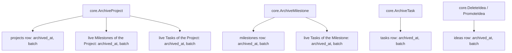
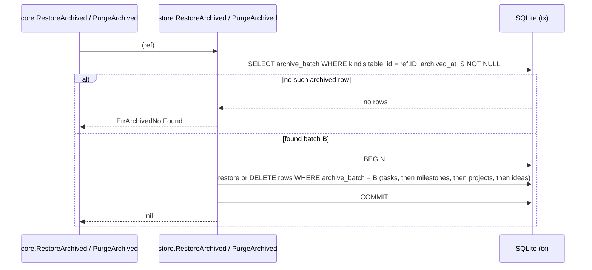

# Archive: cascade, restore, and purge

The Archive (CONTEXT.md) is the only undo. Archiving a Project or a Milestone
sweeps its live children in with it; restoring or purging later must act on
exactly that swept-in group, not on every child the parent happens to have at
that later moment.

## Cascade on archive

Each archive call runs in one transaction and stamps every row it touches with
the same `archive_batch` value — the kind and id of whichever entity was the
root of that call, e.g. `project:12` or `milestone:5` (`internal/store/project.go`,
`internal/store/milestone.go`). A Task or Idea archived on its own carries its
own `kind:id` as a batch of one. Only rows that are *live at that moment*
(`archived_at IS NULL`) are swept in — a Task archived earlier, independently,
keeps its own batch and is left alone.

## Restore and purge act on the batch, not the parent

`core.RestoreArchived` and `core.PurgeArchived` take an `ArchiveRef` (kind +
id) naming any one archived row, look up its `archive_batch`, and then act on
every row across `projects`, `milestones`, `tasks`, and `ideas` that shares
that batch:

Purge deletes in that child-before-parent order so it never trips the
`FOREIGN KEY` constraints `internal/store/store.go` turns on — Tasks before
Milestones before Projects. Purge is deliberately symmetric with restore: it
takes back everything that one archive call put in, not just the single row
named by `ref`.

Because a Task archived independently never shares a cascade's batch — whether
it was archived before that cascade ran, or after an earlier cascade was
restored — restoring or purging the cascade never touches it.

## `core` surface

- `core.ArchiveProject`, `core.ArchiveMilestone`, `core.ArchiveTask`,
  `core.DeleteIdea` — archive one entity (Project/Milestone cascade; Task/Idea
  do not, Ideas having no children).
- `core.ListArchived` — every currently archived entity, across all four
  kinds.
- `core.RestoreArchived(ref)` / `core.PurgeArchived(ref)` — reverse or
  permanently remove the cascade that archived `ref`.
