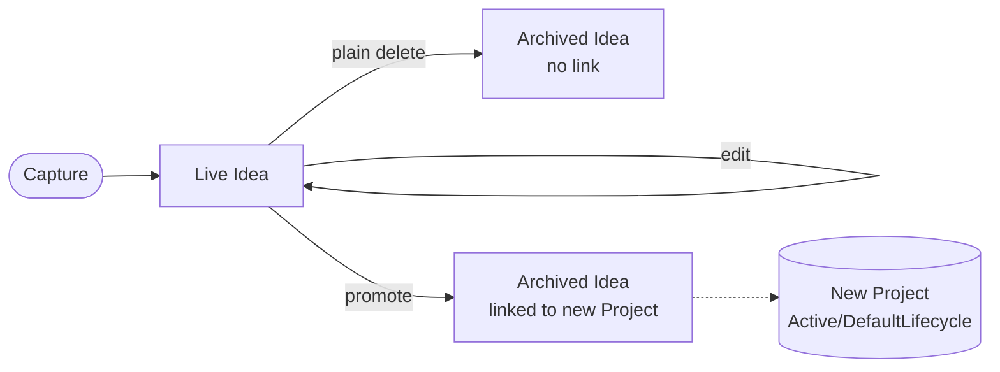
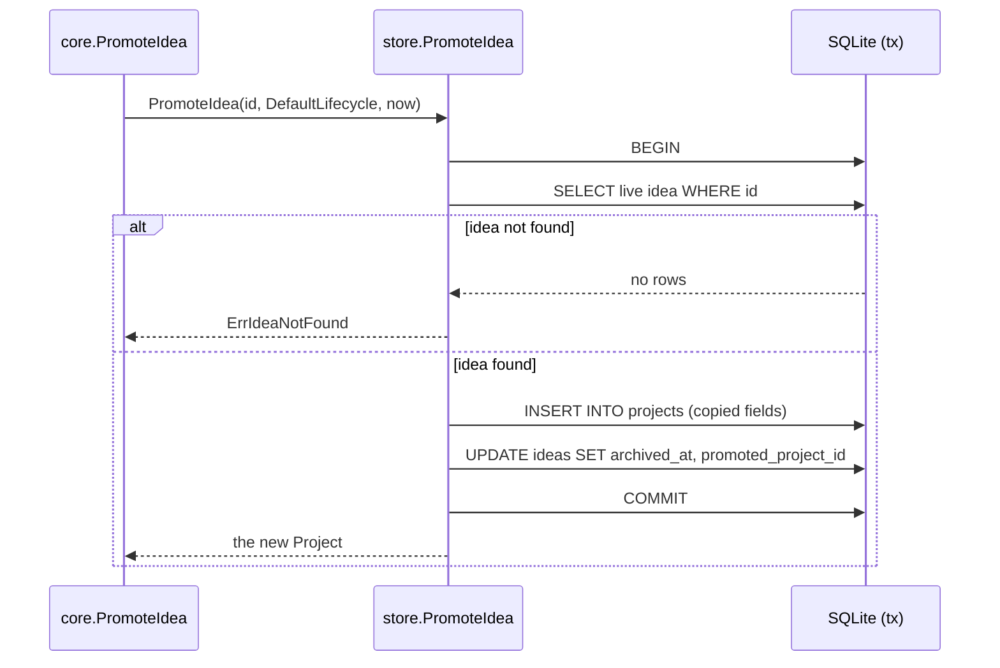

# Idea capture, browsing, editing, deletion, and promotion

An Idea (CONTEXT.md) is a lightweight, non-Project capture of something the
user might do later: a name, description, optional notes, and a Category. It
is never actionable and never a Do Next candidate — it lives in its own table
rather than as a Project lifecycle state, so it can never appear among Active
Projects.

## Lifecycle

- **Capture**: `core.CreateIdea` — name is trimmed and required, Category must
  exist.
- **Browse**: `core.ListIdeas` — live Ideas only, creation order.
- **Edit**: `core.EditIdea` — rewrites name, description, notes, and Category
  on a live Idea; same validation as capture (`Store.UpdateIdea`).
- **Plain delete**: `core.DeleteIdea` — soft-deletes with no link
  (`Store.ArchiveIdea`).
- **Promote**: `core.PromoteIdea` — soft-deletes with a link to the Project it
  became (`Store.PromoteIdea`).

## Promotion is one transaction

Promotion has to do two things — create the Project and archive the Idea with
a link to it — and neither may happen without the other, or a crash between
them would leave an orphan Project or an Idea that looks live but has already
become one. `Store.PromoteIdea` (`internal/store/idea.go`) does both inside a
single DB transaction, the same pattern `WriteBodyOrder` uses
(`internal/store/body.go`) for its own multi-step consistency:

Any failure at any step rolls back the whole transaction, so a partial
promotion never persists.

## TUI

The Ideas panel is folded into the dashboard screen (toggled with `i`) rather
than a third screen — the TUI is fixed at exactly two screens
(`tui/tui.go`) — the same way the Do Next view (`tui/donext.go`) already
works.
